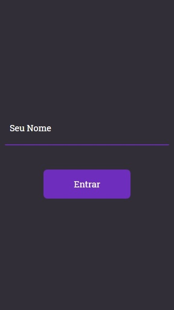
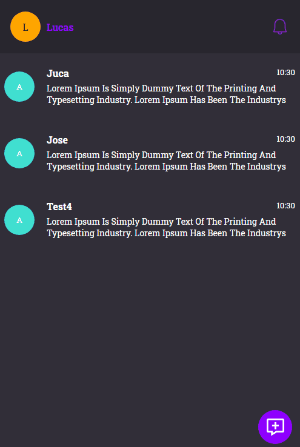
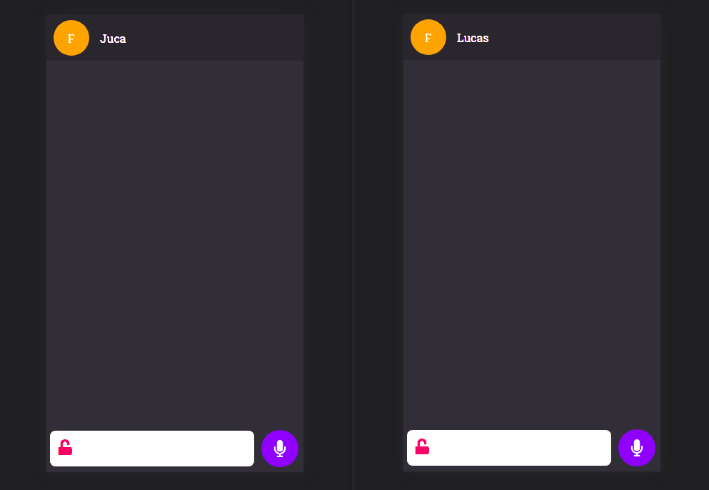

<h1 align="center">
  MyChatWithBot
</h1>

<!-- <h3 align="center">
    <a href="https://hebertryann.github.io/react-gh-pages/#/">Teste o MyChatWithBot</a>
</h3> -->

<p align="center">
  Plataforma criada para alem de propor uma comunicação com seus amigos conseguir jogar algo em grupo e torna as conversas bem mais divertidas. Tudo isso gerenciado por um bot de facil interação alem de engraçado
</p>

<h4 align="center"> 
🚀 MyChatWithBot Em Andamento 🚧
</h4>

<h2>
  <p>Login</p>
  <div align="center">
    
  </div>
</h2>

<h2>
  
  <p>Dashboard</p>
    <div align="center">
      
    </div>
</h2>

<h2>
  <p>Conversa</p>
    <div align="center">
      
    </div>
</h2>


<p align="center">
 <a href="#-tecnologias">Tecnologias</a> • 
 <a href="#autor">Autor</a>
</p>

### 🛠 Tecnologias

As seguintes ferramentas foram usadas na construção do projeto:

- React
- TypeScript

### Funcionalidades
---
- Paginas
  - [x] Pagina de Login
  - Pagina de Cadastro
  - [x] Pagina de Dashboard
    - [x] Adicionar Amigos
    - [x] Criar Grupos
    - [x] Acesso a Notificações
  - [x] Pagina de Conversa
    - [x] Mensagens de audio
- Jogos
  - Forca
  - Adivinhe o Cantor
  - Quiz
- Lojinha
  

## Teste Local
### Pré-requisitos

Antes de começar, você vai precisar ter instalado em sua máquina as seguintes ferramentas:
[Git](https://git-scm.com), [Node.js](https://nodejs.org/en/). Além disto é bom ter um editor para trabalhar com o código como [VSCode](https://code.visualstudio.com/)

### 🎲 Rodando o Frontend (Pagina Web)

```bash
# Clone este repositório
$ git clone https://github.com/HebertRyann/mychatwithbot

# Acesse a pasta do projeto no terminal/cmd
$ cd mychatwithbot

# Instale as dependências
$ npm install

# Execute a aplicação em modo de desenvolvimento
$ npm run start

# A pagina web ficara disponivel localmente e voce pode acessar atraves de <http://localhost:3000>
```

### 🎲 Rodar o Backend (Servidor)
## Navegue até o repositório  do [Backend](https://github.com/HebertRyann/mychatwithbot-backend). Siga o passo a passo

### Autor
---

<a href="https://www.linkedin.com/in/hebertryansantos/">
 
 <br />
 <sub><b>Hebert Santos</b></sub></a> <a href="https://www.linkedin.com/in/hebertryansantos/" title="Perfil">🚀</a>

Feito com ❤️ por Hebert Santos Com o intuito de consolidar meus conhecimentos 👋🏽 Entre em contato!
#### Para conferir mais sobre meu trabalho e ver mais projetos acesse meu [Portfolio](https://hebertryann.github.io/portfolio/)

[](https://www.linkedin.com/in/hebertryansantos/) 
[](mailto:hebertryann40@gmail.com)


<!-- # Requisitos

### Lojiha

# --------------------------------------------- #

# Jogos ## 

### [] - Fazer a forca 

### [] - Fazer a Emojis

### [] - Fazer a Quest

# --------------------------------------------- #

# Forca #

### [] - Modal para aceitar ou recusar

### [] - Coraçoes para os erros

### [] - Escolher a palavra automatico e maual

### [] - O usuario deve poder repetir o jogo


### Request ###

# [✔] - Alert com aceita e recusa detro

# [] - Alerta de messages so pode ser mostrado se estive fora do dash e da propria coversa

# [] - Fazer o alerta de novas menssagens

# [] - A pessoa do dash em 1 tem quer a com a msg mais recete

# [✔] - fazer equest de group e a request tem que ter o ome do grupo

# [✔] - Request de grupos nao esta sendo em real time


# Animaçoes #

# [✔] - terminar as animaçoes comm css 
# [] - Selecionar o usuario criar grupos nao funciona com touch ele uga


### Menssagens ###

# [✔] - Menssagens nao estao sendo enviadas
# [] - Eviar message de audio

### Menssagens Audio ###

# [] - Eviar message de audio


### Grupos ###

# [✔] - Criar grupos nao funciona

# [✔] - Quando criar o grupo remover os selecionados

# [✔] - Nao e ter mais de um grupo um sustitui o outro

# [✔] - termiar estilos da criaçao

# [✔] - ajeitar a fuçao de press 

# [✔] - Quado remover tosos os usuarios da criaça odo grupo mover-lo para o modal aterior 


###### METAS PASSADAS todas feitas

## TERMINAR EM 3 DIAS, 4 DIA FAZER O MEU PERFIL

## O USUARIO QEU ESCOLHER NAO PARA A FORCA NAO DEVE VER A PALAVRA NEM OS CORAÇOES OU SEJA NAO ESCITE NO GAME

## O USUARIO QUE ESCOLHER NAO NAO PODE ENVIAR MENSAGEM

## FAZER O PERGUNTA E RESPOSTA

## 1-Mandar a quest ✔

## 2-Mudar a quest enquanto o jogo esta em andamento ✔

## 2-Mudar a quest enquanto o jogo esta em andamento ✔

## 3-COLOCAR O ACERTO REUTILIZANDO O DO EMOJIS ✔

## 4-Pergutar quatas quest eles querem 6,8,10,12 ✔

## 5-pergutas quatas temas eles vao querer 1,2 ou 3 ✔

## 8-mada ao fial quatos cada acertou ✔

## 9-colocar uma explosao de cofete e abri um modaul com um yop rankinhg ✔

## 10-FAzer o modal de win ✔

## 11- fazer o caminho aleatorio ✔

## FAZER O MEU PERFIL ADMIN

## Ajeitar a forca { Messagem de saida como do admin, camiho de escolher, caminho aleatorio, restart quando ganha e perde, nao deixar a mesma letra errada tira 2 vidas de pessoas diferente, coraçoes sendo retirados e renderizados em tela } ✔

## Ajeitar os quest { Terminado: caminho de escolher, caminho aleatorio, caminho de restart } ✔

## AJEITAR EMOJIS { FAZER O ACTIVE GAME FAZER O GAME COMEÇAR, FAZER O RESTART, TROCA A ESTRUTURA DE DADOS PARECIDO COM AS QUESTS } ✔

## e prencher todos o jogos com as informaçoes

## colocar no ar

## fazer a mensagem ao final de todos o s games para recomeça ✔

## FAZER O DIGITANDO COMO O DO FACE ✔

## COLOCAR COR NOS NOMES ✔

## MUDAR O ENVIADNO PARA O ICON ✔

## TROCA PARA LARANJA ✔

## COLOCAR O SCROLL AUTOMATICO ✔

## NAO DEIXAR 2 USUARIOS COM A MESMA COR ✔

## TROCAR A COR DAS BOLHAS DE TYPING PARA A COR DA PESSOA SO OS DOTS ✔

## QUANDO O USUARIO DER REFSRESH ELE SAI DO CAHT DE VOLTA PARA O SIGIN

# OU DESCOBRI PQ ISSO ACONTECE OU DESATIVAR xD ✔

## FAZER OS JOGUINHOS ✔

## fazer a forca UNIDOS VENCEREMOS EU E MEUS BOTS ✔

## FAZER A FORCA ACKED ✔

## DLÇ Foco na adivinhaçao depois os outros ✔

## no final fazendo um filter manda uma mesagens com os acertod de cada um ✔

## FAZER AS PALAVRAS ERRADAS ✔

## FAZER AS VIDAS ✔

## ESTILIZAR OS COMPOETS ✔

## QUADO ACAAR MADA A MESAGEM DADO OS PARAES E MOTRADO QUEM ACERTOU MAIS LETRAS E QUEM FOI DESCLASSIFICADO

## FAZER O PLAYER DE MUSICA ✔

## TERMIAR O SEARCH ✔

## FAZER O PLAYER RETRATIL ✔

## TERMIAR A PERGUTA DE DESISTECIA ✔

## MUDAR AS MENSAGENS DO SISTEMA fazer sumir X

## terminar de preencher os arrays com os emojis

## FAZER O TEMPO DAS MESSAGES -->
